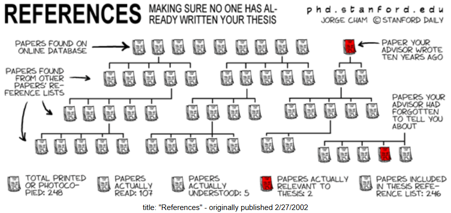
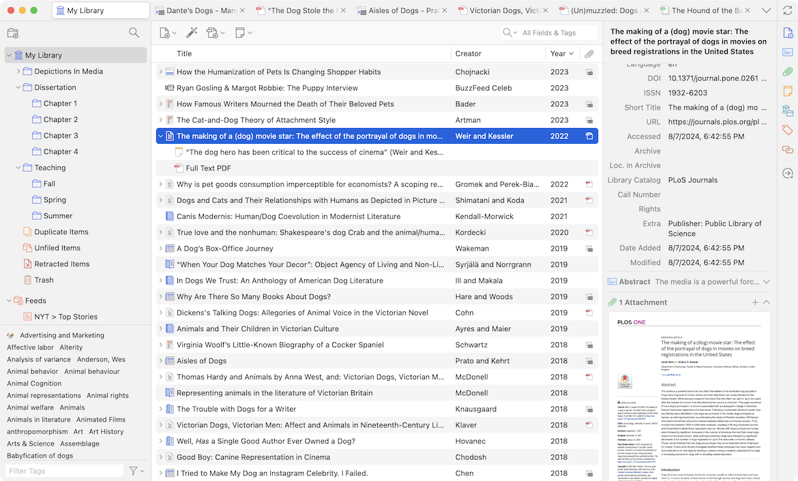

I have used Zotero since my undergrad program to organize my references and *automagically* format reference lists for all my papers. 
Zotero is an example of a reference management system (RMS, aka, citation/reference manager).
While many students, academics, and writers choose not to use Zotero or any other modern RMS, everyone uses some technology to organize references, even if that is just a pen-and-paper.
If you have not used a RMS before, I hope this post encourages you to try one.

## Common RMS Software
Modern RMSs are an important part of today's research and scientific/scholarly writing infrastructure, alongside other computing and information technologies such as:

- libraries,
- literature databases, 
- markup-based typesetting systems (like LaTeX),
- word processors (like MS Word),
- spreadsheet editors (like MS Excel),
- text editors and IDEs (like Windows Notepad and Visual Studio Code),
- statistical software,
- file systems and online storage 

Like these other technologies there are many different softwares. 
The five most popular appear to be EndNote, Mendeley, Zotero, RefWorks, and Citavi.
This [Wikipedia page](https://en.wikipedia.org/wiki/Comparison_of_reference_management_software#) is an invaluable resource for comparing these and other RMSs.
Nearly all my experience is with Zotero, so I would have very little to add to this comparison.

## Common RMS Uses
@KarReferencemanagementSoftware2016 describes three uses of RMSs in academic writing:

1. **Searching for and collecting sources**.
   Many RMSs automatically extract bibliographic data from PDFs or have extensions in browsers that capture such data from webpages. 
   RMSs will also import common bibliographic data files (e.g., RIS and BibTex).
2. **Storage of bibliographic information**.
   RMSs enable large collections of sources to be built, organized, and searched.
   Some will store full text PDFs and allow their viewing and annotation.
3. **Formatting citations and reference lists**.
   Of course, the most concrete benefit of an RMS is the instant generation of reference lists that are correctly formatted in virtually any style.
   With an RMS, there is no reason for any formatting errors.

Any RMS user will find the process of searching, storing, and formatting citations much faster and more reliable than if these were done manually.
If you haven't tried one of the RMS applications, you really ought to.
Being able to insert citations as you write and have a formatted reference list when you are done, is a game-changer.
Much more of your writing time is actually spent writing rather than fiddling with citation formats.

Beyond the common uses above, there is another very important use of RMSs:

4. **Supporting data collection in meta-research**.
   Most RMSs can import collections of citations in many different file formats and remove duplicate (i.e., "deduplicate").
   RMSs also enable the export of citations to common formats which can then be imported into other applications for screening or analysis.

This fourth use is described in detail in soon-to-be-released working paper.
In short, meta-research studies collect primary studies and synthesize their results (e.g., meta-analyses) or analyse their metadata (e.g., bibliometrics).
RMSs fulfill the role of a spreadsheet editor, like MS Excel, where data is collected and cleaned before the analysis.
The working paper will review the details of how RMSs are used in meta-research and the problems that result.

## How To Get Started
I have never had a bad experience with Zotero and its ongoing development has added great features like a PDF viewer that supports annotations.
In contrast, several people have told me about their frustrations with EndNote and Mendeley.
These programs seem to be both less flexibile and less user-friendly.
I recommend anyone trying a RMS to start with Zotero.

The standalone desktop application can be downloaded here.
The application alone is very useful, but its true potential is unlocked with plugins for the web browser and word processer.
The browser plugin provides a button that automatically creates a source in your zotero collection based on the webpage.
If viewing the online or PDF version of an academic article, the citation information for that article is automatically populated.
The word processor plugin provides buttons for choosing a citation style for the document, inserting in-text citations, and generating bibliographies.

With that, the standard zotero workflow is established.
Research your topic, add notes to your collections, and read and annotate within Zotero.
Then write, cite, and insert bibliographies without once having to check citation style standards.
For more information see the [Official Quick-Start Guide](https://www.zotero.org/support/quick_start_guide).

## Recommendations
Beyond using Zotero, I would make a few recommendations.
First, do not use the collections or tag system in Zotero to organize your references.
Using these features right away will probably lead to wasted time as you create elaborate organizational schemes that are locked into Zotero.
At some point, you may find it very helpful to use these features, but do not adopt a solution to a problem which does not yet exist.

Second, backup your Zotero library by creating a free account.
A basic account with minimal storage (still many hundreds of references) saves so much frustration if you lose your local storage.
It also makes it super easy to switch devices.
If you need more storage, you can upgrade your account for a very reasonable subscription price or export collections into a file and keep a copy in your backup location of choice (such as Dropbox).

Third, if you write in LaTeX, markdown, or other plaintext system check out the *Better BibTeX* community plugin.
This is an amazing plugin which unlocks so many integrations with other applications.
I take notes in Obsidian and use the automatic export to keep a `.bib` file updated with all my references.
I also write in Neovim and the automatic export for subcollections is great for exporting `.bib` files specific to each project.
At some point, I will share my note-taking and writing setup and how Zotero integrates with each in greater detail.

In my opinion, undergraduate and/or graduate students should be required to use an RMS for one or more classes in their programs.
Within 30 minutes, you can get started and see real benefits.
